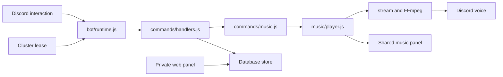

# Developer handbook: Tutel music bot

[ภาษาไทย](DEVELOPMENT.th.md) · [Contribution workflow](../CONTRIBUTING.md) · [Calendar repository](https://github.com/DoubleP987/tutel-calendar)

Updated 10 October 2026. This guide describes the current source. Production activation is a separate operation; the new Calendar worker is not yet the active production reminder system.

## Contents

1. Ownership and runtime
2. Start an isolated development environment
3. Environment variables and dependencies
4. Trace a command and audio playback
5. Where to change a feature
6. Database and configuration changes
7. Calendar service contract
8. Development conventions
9. Verification and troubleshooting
10. Deployment, rollback and handover

## 1. Ownership and runtime

This repository owns Discord interactions, music/radio, guild playback settings, active-host election and the private server panel. Calendar web users/groups/OAuth/SQLite belong to the separate Calendar repository. The legacy calendar remains under `src/integrations/calendar/legacy/` until migration.



`src/index.js` loads environment/logging, initializes panel accounts, selects a Calendar scheduler, starts the panel, then starts cluster election or the standalone Discord client. Shutdown stops publishers/schedulers/relays, closes Discord, HTTP and the data store. Importing this entry point starts real services; do not use it as a unit-test helper.

Bot queues, voice resources, prepared audio and private-menu state are memory, not durable database records. Host failover does not resume the same audio position. The private panel and public promotion site are separate from the bot voice connection.

## 2. Isolated development setup

Requirements: Node.js 24+, npm, Git, a **development Discord application/token**, a test guild, and yt-dlp accessible through `YT_DLP_PATH`. FFmpeg uses `FFMPEG_PATH`, a Linux system executable, or the npm bundle as configured in `src/music/ffmpeg.js`.

```powershell
git clone https://github.com/DoubleP987/tutel-hub.git
cd tutel-hub
npm ci
Copy-Item .env.example .env
```

Use a different bot token from production. Set `DISCORD_TOKEN`, `CLIENT_ID`, `GUILD_ID`, `DATABASE_PROVIDER=sqlite`, `DATABASE_PATH=./data/dev.sqlite`, `CONTROL_HOST=127.0.0.1`, `CONTROL_PORT=3000`. Leave `CLUSTER_NODE_ID`, MongoDB/service/publishing secrets blank and `CALENDAR_GROUPS_ENABLED=0`. Do not reuse the production shared MongoDB database: command registration, settings and reminders could affect real users.

```powershell
npm run register:guild
npm start
```

`register:guild` changes the application commands in the configured test guild. Global `npm run register` changes the application's global commands. Registration is not a read-only check. Invite the development bot with appropriate application-command, text/embed and voice permissions. Permission failures must be handled; do not request administrator merely to avoid identifying a missing permission.

The panel is at http://127.0.0.1:3000. Initial account/password behavior is in `src/auth/accounts.js`; a blank `ADMIN_INITIAL_PASSWORD` generates a private initial password. Never document or commit the generated value. Stop the foreground process with Ctrl+C. The existing bot_enabled setting can prevent login even when the token is valid.

## 3. Configuration and dependencies

| Configuration                                 | Purpose                                | Development rule                      |
| --------------------------------------------- | -------------------------------------- | ------------------------------------- |
| DISCORD_TOKEN / CLIENT_ID / GUILD_ID          | Discord identity and test registration | Use development application           |
| BOT_LANGUAGE                                  | th/en UI override                      | Blank uses src/config/bot.js          |
| CONTROL_HOST / CONTROL_PORT                   | Private panel listener                 | Loopback; do not expose casually      |
| DATABASE_PROVIDER / DATABASE_PATH             | SQLite or MongoDB store                | Separate development database         |
| MONGODB_URI / MONGODB_DATABASE                | Shared bot persistence                 | Server-only; not Calendar SQLite      |
| CLUSTER_NODE_ID / CLUSTER_PRIMARY_NODE        | Host election                          | Blank node ID for standalone          |
| CLUSTER_CONTROL_SECRET                        | Protected command relay                | Not a browser/public key              |
| MUSIC_SOURCE_OVERRIDE                         | Host-wide search source override       | Oracle may force SoundCloud           |
| YT_DLP_PATH / FFMPEG_PATH                     | External media executables             | Check installed versions/paths        |
| CALENDAR_GROUPS_ENABLED                       | Select new reminder worker             | Keep 0 until coordinated cutover      |
| CALENDAR_SERVICE_URL / CALENDAR_WEB_URL       | Service API / user-facing Calendar URL | Distinct purposes                     |
| CALENDAR_BOT_SECRET / CALENDAR_CONTROL_SECRET | Delivery / platform-management access  | Separate keys, at least 32 characters |
| CALENDAR*SYNC*\* / PUBLIC_DEPLOY_PROVIDER     | Legacy snapshot publication            | Leave disabled/blank in dev           |

`discord.js` supplies client, interactions, builders and REST. `@discordjs/voice` manages voice resources/connections; FFmpeg converts media and yt-dlp resolves/extracts media. `opusscript` supports Opus audio encoding. Express/Helmet serve/protect the private panel. MongoDB implements shared persistence/election; Node SQLite supports a single-host store. dotenv loads server environment; Prettier formats source. Check package-lock.json for installed versions rather than copying versions from a tutorial.

## 4. Command and playback lifecycle

1. `src/commands/definitions.js` defines slash-command options; registration uploads them to Discord.
2. `src/bot/runtime.js` receives interactions, checks active-host ownership and handles commands/buttons/autocomplete.
3. `src/commands/handlers.js` maps command names to modules. Slow work needs an acknowledged/deferred interaction before network/audio operations.
4. Music request/search/link/playlist modules normalize input, resolve metadata and enqueue tracks. URL input must not be treated as a normal search query.
5. `src/music/player.js` coordinates queue/random/radio, voice and preparation. Stream/FFmpeg code owns process cleanup and cancellation.
6. `src/music/panel.js` updates the existing shared control message. Temporary replies are managed by `src/bot/private-replies.js`.

Smooth audio is not “download every song.” The transition path uses prepared resources, bounded buffering/backpressure and short PCM fades (`FADE_MS=350` in `transition.js`). Queue/genre changes must cancel obsolete preparation; unknown duration, long clips, failed next tracks and radio require their own handling. Do not promise zero gaps for unavailable streams. See SMOOTH-TRANSITION.md before editing that pipeline.

## 5. Feature modification map

| Change                 | Start here                                    | Also inspect                                                |
| ---------------------- | --------------------------------------------- | ----------------------------------------------------------- |
| Slash command          | commands/definitions.js, commands/handlers.js | commands/music.js or new handler, runtime.js                |
| Player button/settings | music/panel.js, music/settings.js             | runtime.js component routing, private-replies.js            |
| Genre choice           | music/genres.js, music/genre-menu.js          | random.js, music-autocomplete.js, 25-option menu constraint |
| URL/playlist metadata  | music/links.js, metadata.js, playlist.js      | requests.js, search.js, cancellation                        |
| Transition/skip        | music/player.js, stream.js, transition.js     | ffmpeg.js, queue.js, resource cleanup                       |
| Radio catalog/status   | music/radio-directory.js, radio-health.js     | commands/radio-list.js, radio-panel.js                      |
| Text/language          | config/bot.js, i18n/bot.js, i18n/en.json      | definitions registration for descriptions                   |
| Private panel          | web/routes/, web/public/                      | auth/sessions.js, middleware/security.js                    |
| Store field            | database/schema.js, store.js                  | existing persisted records and both providers               |
| Host failover          | cluster/                                      | bot runtime guards, jobs/watchdog, lease expiry             |

For a new command: add the definition, implement/export its handler, connect the handler map, document permissions and replies, then register only in the development guild. For a new panel button: use a namespaced custom ID, route it through the existing component handler, validate user voice-channel access and expire private menus through the common helper. Never send a new shared player merely because an existing message can be edited.

## 6. Persistence and migrations

Use `src/database/connection.js`/`store.js` rather than opening a new SQLite/MongoDB connection in a command. Store operations are asynchronous; await writes and handle failures. The adapter supports a limited filter/operator vocabulary, not arbitrary MongoDB query semantics. Review its whitelist and predicate implementation before adding an operator/table.

When adding a persisted field:

1. Define a default for old rows, not just new records.
2. Add an idempotent/additive SQLite migration in schema.js and the corresponding MongoDB behavior.
3. Update serializers/validation, settings readers, API output and documentation together.
4. Preserve identifiers used by guild configs, sessions and reminder dedupe.
5. Back up before production migration. No destructive schema drop as part of normal startup.

`npm run db:backup` uses the configured provider. SQLite uses VACUUM INTO; MongoDB exports listed application collections. The logical export is not a backup of every Atlas collection/lease or a verified restore procedure. Backups contain sensitive data and stay outside Git. Review scripts/migrate-to-mongodb.js and MONGODB-FAILOVER.md before migration; never execute migration against a live database as an experiment.

## 7. Calendar integration contract

`integrations/calendar/client.js` sends server-side bearer authentication to `/internal/v1/bot` or `/internal/v1/control`. Delivery and management secrets differ. HTTP is allowed only on loopback; remote connections require HTTPS. Neither secret may reach browser JavaScript, Discord responses or logs.

The worker runs only with a ready Discord client and active-host ownership. Delivery flow: fetch bindings → claim jobs → mark start → send → acknowledge message ID. A send followed by lost acknowledgment is uncertain, not an invitation to resend blindly. Calendar source owns job persistence and group authorization.

Do not simply set CALENDAR_GROUPS_ENABLED=1: preserve/migrate channel bindings, validate categories and date links, coordinate both bot hosts, and avoid running old/new schedulers together. The original publisher/importer still forms a one-way bridge; remove it only with a migration plan. See Calendar GROUPS.md and CURRENT-STATUS.md.

## 8. Code conventions

- ESM imports, explicit .js paths, two-space formatting, semicolons and single quotes; use existing Prettier configuration.
- Keep Discord specifics in handlers/UI, audio orchestration in music/, persistence in database/, and external Calendar behavior in integrations/.
- Prefer small named functions. Comment invariants, ownership and unusual timing; avoid comments that only repeat an assignment.
- Validate external input and authorize on the server. Use parameterized queries; render user text rather than HTML.
- Bound network calls, queues and process lifetime. Dispose prepared audio and child processes on replacement/leave/shutdown.
- Log operation/context and sanitized errors, not tokens, authorization headers, signed URLs or raw environment dumps.
- Add dependencies with npm install and commit package.json plus package-lock.json. Reproducible installs use npm ci.

## 9. Verification and troubleshooting

Commands for developers when verification is requested (they were not run merely to write this guide):

```powershell
npm run format:check
node --test tests/music-genres.test.js
node --test tests/private-replies.test.js
node --test
```

There is no npm test script. Node's runner uses the existing tests/ files. Inspect each test's imports before running it: modules can initialize data, processes or network state. Existing tests do not replace real voice/Discord/guild authorization checks.

Manual acceptance on a development bot: join idle; direct/short URL play; enqueue/playlist; skip/cancel; pause/resume; song/queue loop; genre change while random is active; radio failure/switch; same panel message; private expiry; stop/leave and child-process cleanup. Exercise two guilds to detect accidental global settings.

| Symptom                 | Investigate                                                                |
| ----------------------- | -------------------------------------------------------------------------- |
| No commands             | App/token IDs, guild registration, invite scope, global propagation        |
| No audio                | Active host, voice permissions, yt-dlp/FFmpeg logs, stream validity        |
| Unknown length          | metadata.js/URL resolution; distinguish live streams from missing metadata |
| Duplicate reminders     | Old/new scheduler overlap, claim/ack uncertainty, host lease               |
| Panel unauthorized      | Session expiry, CSRF, role and relay ownership                             |
| Radio online but silent | Real stream content, codec, redirects and decoder output                   |

Production logs: `journalctl --user -u tutelbot.service -f` on existing hosts. deploy/tutel-hub.service is a template, not proof of the installed unit name/path. Never paste complete logs containing credentials into an issue.

## 10. Release, rollback and handover

Use a feature branch and focused commits. Review git diff and staged paths; exclude .env, data/, private/, backups/, generated personal snapshots and dependency folders. Review API/command changes with the Calendar maintainer. Update README, relevant specialist docs and this guide when ownership/setup changes.

Before deployment: record revision/provider/active host, save a consistent database backup and old release, and confirm runtime paths from the installed unit. Deploy source/lockfile without replacing .env/data. Install locked dependencies, register commands only when definitions change, restart one host at a time under the election policy, inspect status/logs, then verify features when authorized. Git push may trigger hosting CI; it is not an explicit server deployment.

Rollback to the recorded release while retaining credentials and database. Additive schema compatibility is preferred; destructive migrations require a separate restore plan. Do not restore a shared MongoDB backup while another host is still writing.

**Next-maintainer checklist:** development bot and guild; secret access through a private channel; provider and lease settings; current production revision; panel exposure; backup/restore owner; source-extractor availability; pending Calendar cutover; uncertain reminder deliveries; current guide/test limitations. Transfer secrets outside Git.

**Known pending work:** coordinated Calendar worker/panel cutover; a separately running Calendar Discord client is not implemented; durable audio failover is not implemented. The Calendar repository also tracks multi-group display/Discord-link visibility and unverified mail/Push delivery. Repository separation does not complete these tasks.

## Source readability / รูปแบบโค้ดปัจจุบัน

See [the repository conventions](CODE-STYLE.md): explicit control-flow braces, one declaration per statement, paragraphs by responsibility, formatted embedded HTML and multiline SQL with bound parameters.
