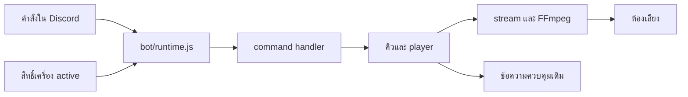

# คู่มือผู้พัฒนา Tutel บอทเพลง

[English](DEVELOPMENT.md) · [ขั้นตอนส่งงาน](../CONTRIBUTING.md) · [repo ปฏิทิน](https://github.com/DoubleP987/tutel-calendar)

ปรับปรุง 10 ตุลาคม 2569 คู่มือนี้อธิบายโค้ดปัจจุบัน การมีโค้ดใน repo ไม่ได้หมายความว่า worker Calendar รุ่นใหม่เปิดใช้จริงแล้ว

## สารบัญ

1. ขอบเขตและการเริ่มระบบ
2. ตั้งเครื่องพัฒนา
3. ค่าตั้งและ library
4. เส้นทางคำสั่งและเสียง
5. เพิ่มฟีเจอร์ตรงไหน
6. ฐานข้อมูลและ migration
7. สัญญา API กับ Calendar
8. แนวทางเขียนโค้ด
9. ตรวจงานและแก้ปัญหา
10. Deploy ย้อนกลับและส่งต่องาน

## 1. ขอบเขตและการเริ่มระบบ

repo นี้ดูแล Discord interactions เพลง วิทยุ คิว การตั้งค่ารายเซิร์ฟเวอร์ การเลือกเครื่องที่ทำงาน และ control panel ส่วนตัว เว็บปฏิทิน บัญชี OAuth สมาชิกและกลุ่มอยู่ repo Calendar โค้ดปฏิทินเดิมเก็บใน src/integrations/calendar/legacy ระหว่างย้ายระบบ

อ่าน package.json และ .env.example ก่อน แล้วตาม src/index.js → bot/runtime.js → commands/handlers.js → music/player.js → database/store.js และ web/server.js



index.js โหลด env/log ตั้งบัญชี เลือก scheduler เปิดเว็บ จากนั้นเปิด cluster หรือ Discord แบบเครื่องเดียว ตอน shutdown หยุด timer/relay/client/server และปิด store ห้าม import entry point นี้เป็น helper ใน unit test เพราะจะเริ่มบริการจริง

คิว เสียงที่เตรียมไว้ voice connection และเมนูส่วนตัวอยู่ใน RAM ไม่ใช่ข้อมูลเสียงถาวร การสลับเครื่องไม่เล่นต่อที่วินาทีเดิม เว็บโปรโมทกับ control panel เป็นคนละส่วนจาก voice client

## 2. ตั้งเครื่องพัฒนาแยก

ใช้ Node.js 24+, npm, Git, Discord application/token สำหรับพัฒนา และ guild ทดสอบ เตรียม yt-dlp ให้ตรง YT_DLP_PATH ส่วน FFmpeg เลือกจาก FFMPEG_PATH โปรแกรมใน Linux หรือแพ็กเกจตาม music/ffmpeg.js

```powershell
git clone https://github.com/DoubleP987/tutel-hub.git
cd tutel-hub
npm ci
Copy-Item .env.example .env
```

ตั้ง DISCORD_TOKEN, CLIENT_ID, GUILD_ID ของบอททดสอบ ใช้ DATABASE_PROVIDER=sqlite และ DATABASE_PATH=./data/dev.sqlite ตั้ง CONTROL_HOST=127.0.0.1 และ CONTROL_PORT=3000 เว้น CLUSTER_NODE_ID และ secrets ของ MongoDB/Calendar/publisher ว่าง คง CALENDAR_GROUPS_ENABLED=0 อย่านำ env/database จริงมาใช้ เพราะจะเปลี่ยนคำสั่ง ค่าเซิร์ฟเวอร์ หรือส่งเตือนให้ผู้ใช้จริง

```powershell
npm run register:guild
npm start
```

register:guild เขียน command ของ application ลง guild ที่กำหนด ส่วน npm run register เขียน global commands ไม่ใช่การตรวจแบบอ่านอย่างเดียว เชิญบอททดสอบให้มีสิทธิ์ command ส่งข้อความ/embed และเข้า/พูดใน voice ที่ต้องใช้ อย่าให้ administrator เพื่อข้ามการหาสิทธิ์ที่ขาด

Panel อยู่ http://127.0.0.1:3000 บัญชีแรกสร้างตาม auth/accounts.js ถ้า ADMIN_INITIAL_PASSWORD ว่างจะสร้างรหัสส่วนตัว อย่าใส่รหัสลงคู่มือ/Git หยุด foreground ด้วย Ctrl+C หาก bot_enabled ในฐานข้อมูลปิดอยู่ token ถูกต้องก็ยังไม่ login

## 3. ค่าตั้งและ library

| ค่า                                           | ใช้ทำอะไร                                                |
| --------------------------------------------- | -------------------------------------------------------- |
| DISCORD_TOKEN / CLIENT_ID / GUILD_ID          | บัญชีบอทและ guild สำหรับ register                        |
| BOT_LANGUAGE                                  | th/en; ว่างใช้ config/bot.js                             |
| CONTROL_HOST / CONTROL_PORT                   | listener ของ panel ส่วนตัว                               |
| DATABASE_PROVIDER / DATABASE_PATH             | SQLite หรือ MongoDB และไฟล์ dev                          |
| MONGODB_URI / MONGODB_DATABASE                | store ร่วมของบอท ไม่ใช่ SQLite Calendar                  |
| CLUSTER_NODE_ID / CLUSTER_PRIMARY_NODE        | เลือกเครื่องและลำดับหลัก; dev เว้น node ID               |
| CLUSTER_CONTROL_SECRET                        | ป้องกัน relay คำสั่งระหว่างเครื่อง                       |
| MUSIC_SOURCE_OVERRIDE                         | บังคับแหล่งค้นหาทั้งเครื่อง เช่น Oracle ใช้ SoundCloud   |
| YT_DLP_PATH / FFMPEG_PATH                     | โปรแกรมดึงและแปลงเสียง                                   |
| CALENDAR_GROUPS_ENABLED                       | เปิด worker ใหม่หลังย้าย channel ครบ                     |
| CALENDAR_SERVICE_URL / CALENDAR_WEB_URL       | API ฝั่ง server / ลิงก์ที่ผู้ใช้เปิด                     |
| CALENDAR_BOT_SECRET / CALENDAR_CONTROL_SECRET | สิทธิ์ส่งเตือน / จัดการ platform แยกกัน อย่างน้อย 32 ตัว |
| CALENDAR*SYNC*\* / PUBLIC_DEPLOY_PROVIDER     | ส่ง snapshot ของระบบเก่า ไม่เปิดใน dev โดยไม่จำเป็น      |

discord.js ทำ client/interaction/builders/REST ส่วน @discordjs/voice ดูแลเสียงและ connection, FFmpeg แปลง media, yt-dlp หาแหล่ง media, opusscript ช่วย codec Opus Express/Helmet ทำและป้องกันเว็บ panel MongoDB รองรับ store/election ร่วม Node SQLite รองรับเครื่องเดียว dotenv โหลด env และ Prettier จัดรูปแบบ อ่านเวอร์ชันจริงจาก lockfile

## 4. เส้นทางคำสั่งและเสียง

1. definitions.js สร้างรูปแบบ command/options การ register ส่งรูปแบบให้ Discord
2. runtime.js รับ interaction ตรวจเครื่อง active และแยก command/button/autocomplete
3. handlers.js ผูกชื่อ command กับ implementation งานช้าต้องตอบรับ/defer ก่อน network/audio
4. requests/search/links/playlist/metadata แยก URL กับคำค้น หา track และเข้าคิว
5. player.js จัดคิว random/radio/voice/การเตรียมเพลง stream/FFmpeg ดูแลโปรเซสและการยกเลิก
6. panel.js แก้ข้อความควบคุมเดิม private-replies.js ดูแลข้อความชั่วคราวที่เห็นคนเดียว

Smooth ไม่ใช่โหลดทุกเพลงไม่จำกัด transition.js มี fade 350ms ใช้ทรัพยากรที่เตรียมไว้และ backpressure จำกัด buffer การเปลี่ยนคิว/แนวต้องยกเลิกเพลงที่เตรียมแล้วไม่ตรง ตัวแปร duration ไม่ทราบ คลิปยาว วิทยุ และเพลงถัดไปโหลดล้มเหลวต้องมี fallback อย่ารับประกันไม่ขาดเสียงเมื่อแหล่งเพลงใช้ไม่ได้ อ่าน SMOOTH-TRANSITION.md ก่อนแก้ pipeline

## 5. เพิ่มฟีเจอร์ตรงไหน

| งาน                   | เริ่มอ่าน                            | จุดที่เกี่ยวข้อง                                     |
| --------------------- | ------------------------------------ | ---------------------------------------------------- |
| Command ใหม่          | commands/definitions.js, handlers.js | handler ใหม่, runtime.js                             |
| ปุ่มเพลง              | music/panel.js, settings.js          | component routing, private-replies.js                |
| แนวสุ่ม               | genres.js, genre-menu.js             | random.js, autocomplete; เมนูเดี่ยวจำกัด 25 ตัวเลือก |
| URL/playlist/duration | links.js, metadata.js, playlist.js   | requests/search และ cancellation                     |
| ข้าม/transition       | player.js, stream.js, transition.js  | FFmpeg, queue, cleanup                               |
| วิทยุ                 | radio-directory.js, radio-health.js  | radio-list.js, radio-panel.js                        |
| ภาษา                  | config/bot.js, i18n/bot.js, en.json  | register เมื่อ description เปลี่ยน                   |
| Panel                 | web/routes และ web/public            | session และ security middleware                      |
| Store field           | database/schema.js, store.js         | SQLite และ MongoDB พร้อมข้อมูลเดิม                   |
| สลับ host             | cluster/                             | lease expiry, jobs/watchdog และ bot guards           |

เพิ่ม command โดยสร้าง definition → handler → handler map → ระบุ permission/reply → register เฉพาะ guild dev เพิ่มปุ่มโดยใช้ custom ID มี namespace เชื่อม dispatcher ตรวจว่าผู้ใช้คุม voice นั้นได้ และใช้ helper หมดอายุร่วม หลีกเลี่ยงส่ง shared panel ใหม่เมื่อแก้ข้อความเดิมได้

## 6. ฐานข้อมูลและ migration

ใช้ database/connection.js และ store.js แทนเปิด connection ใหม่ใน handler ต้อง await operation ของ store ตัว adapter รองรับ filter/operators ที่จำกัด ไม่ใช่ MongoDB query ทุกแบบ อ่าน whitelist/predicate ก่อนเพิ่ม table/operator

เพิ่ม persisted field ต้องกำหนดค่าเริ่มต้นให้ข้อมูลเก่า ทำ additive/idempotent SQLite migration และพฤติกรรม MongoDB ที่สอดคล้อง แก้ validation/serializer/settings/API/docs ด้วย รักษา ID ของ guild/session/reminder dedupe สำรองก่อน migration จริง อย่า drop schema ใน startup ปกติ

npm run db:backup เลือก provider ตาม env SQLite ใช้ VACUUM INTO MongoDB export collections ที่ระบุ ไม่ได้แปลว่าสำรองทุก Atlas collection/lease หรือทดลอง restore แล้ว Backup มีข้อมูลลับ ห้ามขึ้น Git อ่าน scripts/migrate-to-mongodb.js และ MONGODB-FAILOVER.md ก่อนย้าย และอย่าเอาฐานจริงมาลอง

## 7. สัญญา API กับ Calendar

client.js ส่ง bearer ฝั่ง server ไป /internal/v1/bot หรือ /internal/v1/control ใช้ secret คนละชุด HTTP อนุญาตเฉพาะ loopback ที่อื่นใช้ HTTPS ห้ามส่ง key ลง JS ฝั่ง browser, Discord reply หรือ log

Worker ทำงานเมื่อ Discord ready และถือสิทธิ์ active host ขั้นตอนคือ bindings → claim → start → ส่ง → ack message ID หากส่งสำเร็จแต่ ack หายเป็นสถานะ uncertain ต้องตรวจ channel ก่อน resend งานถาวรและสิทธิ์กลุ่มเป็นความรับผิดชอบ Calendar

อย่าเปิด CALENDAR_GROUPS_ENABLED=1 เพียงอย่างเดียว ต้องย้าย binding ตรวจหมวด เวลา และ deep link ประสานทั้งสอง host ไม่ให้ scheduler เก่า/ใหม่ส่งซ้ำ Publisher/importer เดิมยังทำ one-way bridge เลิกใช้ตามแผนย้ายเท่านั้น อ่าน GROUPS.md/CURRENT-STATUS.md ใน repo Calendar

## 8. แนวทางเขียนโค้ด

- ใช้ ESM มี .js ใน import จัดด้วย config Prettier เดิม
- Discord อยู่ handler/UI เสียงอยู่ music persistence อยู่ database ตัวเชื่อม Calendar อยู่ integrations
- ฟังก์ชันเล็กมีชื่อชัด Comment อธิบายเหตุผล/ownership/timing ที่ไม่ชัด อย่าทวนคำสั่ง
- ตรวจ input และ permission ที่ server ใช้ parameterized query แสดง user text ไม่แทรก HTML
- จำกัด timeout คิว buffer และ lifetime โปรเซส ทำ cleanup เมื่อ skip/leave/shutdown
- Log บริบทและ error ที่ล้าง secret แล้ว ไม่ dump env/header/token/URL ที่มีลายเซ็น
- เพิ่ม dependency ด้วย npm install และ commit package.json/lockfile ติดตั้งตามล็อกด้วย npm ci

## 9. ตรวจงานและแก้ปัญหา

คำสั่งต่อไปนี้สำหรับ dev เมื่อได้รับคำสั่งให้ตรวจ ไม่ได้รันเพียงเพื่อเขียนคู่มือนี้:

```powershell
npm run format:check
node --test tests/music-genres.test.js
node --test tests/private-replies.test.js
node --test
```

ไม่มี npm test script ใช้ Node runner กับ tests ที่มี อ่าน imports ก่อน เพราะอาจเปิด DB/process/network Unit test ไม่แทนการลองเสียง Discord และสิทธิ์จริง

Checklist บอท dev: join idle, ลิงก์สั้น/ยาว, enqueue/playlist, skip/cancel, pause, loop song/queue, เปลี่ยนแนว random ระหว่างเล่น, วิทยุล่ม/สลับ, panel message เดิม, reply หมดอายุ, stop/leave และ child process cleanup ลองสอง guild เพื่อจับการตั้งค่าที่เผลอใช้ global

| อาการ                  | ตรวจ                                           |
| ---------------------- | ---------------------------------------------- |
| ไม่มี command          | app/token/guild, registration, invite scope    |
| ไม่มีเสียง             | active host, permission, yt-dlp/FFmpeg, stream |
| ไม่รู้ duration        | metadata/URL กับ live stream ต้องแยกกัน        |
| เตือนซ้ำ               | scheduler ซ้อน, uncertain ack, lease           |
| Panel เข้าไม่ได้       | session/CSRF/role/relay                        |
| วิทยุขึ้น online เงียบ | stream จริง codec redirect และ decoder         |

Log ของ unit ที่ใช้จริงคือ journalctl --user -u tutelbot.service -f ไฟล์ deploy/tutel-hub.service เป็น template ตรวจชื่อและ path ที่ติดตั้งจริง อย่าแปะ log มี credential ลง issue

## 10. Deploy ย้อนกลับและส่งต่องาน

ใช้ branch/commit ที่โฟกัส ตรวจ diff/staged files ไม่รวม .env data private backups snapshot ส่วนตัวหรือ node_modules แก้ README และคู่มือฟีเจอร์ รวมถึงประสานผู้ดูแล Calendar เมื่อเปลี่ยน API

ก่อน deploy บันทึก revision/provider/host active สำรองฐานและ release เดิม ตรวจ unit path ส่ง source/lockfile โดยไม่ทับ .env/data ใช้ npm ci register เมื่อ definition เปลี่ยนเท่านั้น restart ทีละ host ตาม election อ่าน status/log และทดสอบเมื่อได้รับอนุญาต Git push อาจ trigger CI เว็บ แต่ไม่ใช่การ deploy บอทด้วยตนเอง

Rollback กลับ release ที่บันทึก รักษา credentials/database migration ควร additive หากทำลาย schema ต้องมีแผน restore แยก อย่า restore MongoDB ขณะอีก host ยังเขียน

**ส่งต่อให้ dev คนใหม่:** บอท/guild ทดสอบ ช่องทางรับ secret ส่วนตัว provider/lease revisionจริง panel exposure backup/restore owner extractor versions งาน Calendar cutover และ deliveries uncertain รวมถึงสิ่งที่ยังไม่ได้ตรวจ อย่าส่ง secret ใน repo

**งานค้าง:** Calendar worker/panel cutover, Calendar Discord client ที่รันแยก และ durable audio failover ยังไม่เสร็จ ส่วน Calendar มีงานหลายกลุ่ม/ลิงก์ Discord และ mail/Push verification การแยก repo ไม่ได้ทำงานเหล่านี้ให้เสร็จเอง
